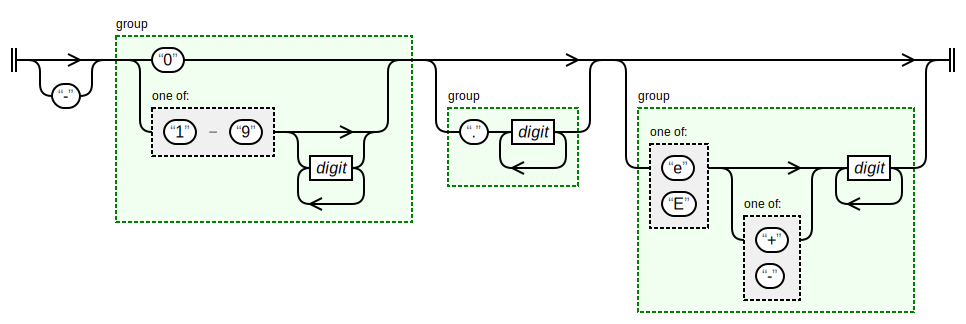
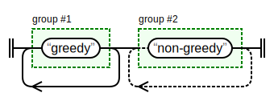
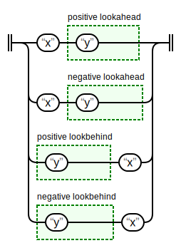

# regexp-diagram

🔗 <https://takayoshiotake.github.io/regexp-diagram/> draws regular expression patterns like railroad-diagram. Regular expression syntax follows the MDN Web docs. And, from v1.1.0, named capture groups and lookbehind are supported.

## Examples

### Number

```raw
-?(?:0|[1-9]\d*)(?:\.\d+)?(?:[eE][+-]?\d+)?
```



### Greedy and Non-Greedy Matching

```raw
(greedy)+(non-greedy)+?
```



### Lookahead and Lookbehind

```raw
x(?=y)|x(?!y)|(?<=y)x|(?<!y)x
```



## Issues

- `.{2}{2}` should be error: Nothing to repeat (2022-11-23, v1.1.2-beta)

## Special thanks

- 🔗 <https://developer.mozilla.org/en-US/docs/Web/JavaScript/Guide/Regular_Expressions>
